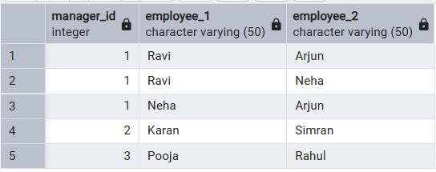

# LAB MST Submission

<hr>

### Name: Prateek Verma
### UID: 25MCC20062
### Class/Section: 25MCC 101 - A

<hr>

# Table Creation and Insertion

```sql
CREATE TABLE Employees (
    emp_id INT PRIMARY KEY,
    emp_name VARCHAR(50),
    manager_id INT,
    department VARCHAR(50),
    salary INT
);
INSERT INTO Employees VALUES
(1, 'Amit', NULL, 'Management', 120000),
(2, 'Ravi', 1, 'Engineering', 80000),
(3, 'Neha', 1, 'Engineering', 82000),
(4, 'Karan', 2, 'Engineering', 60000),
(5, 'Simran', 2, 'Engineering', 62000),
(6, 'Pooja', 3, 'Engineering', 61000),
(7, 'Rahul', 3, 'Engineering', 64000),
(8, 'Arjun', 1, 'HR', 70000);

```


## Question 1
```
Write a SQL query to find all unique pairs of employees who report to the same manager.
Requirements

1. Only include employees who share the same manager.
2. Do not include employees without a manager.
3. Avoid duplicate pairs.
4. (EmployeeA, EmployeeB) should appear once.
5. (EmployeeB, EmployeeA) should not appear.

Output the following columns:
manager_id
employee_1
employee_2
```

## Solution
```sql
SELECT 
    e1.manager_id, 
    e1.emp_name AS employee_1, 
    e2.emp_name AS employee_2
FROM 
    Employees e1
JOIN 
    Employees e2 
    ON e1.manager_id = e2.manager_id
where 
	e1.manager_id IS NOT NULL
	AND
	e1.emp_id < e2.emp_id;
```



## Question 2
```
Write an SQL query to find the second highest salary from an Employee table having columns (EmpID, EmpName, Salary). (Note: All salaries are distinct)
```

## Solution
``` sql
select salary as SecondHighestSalary from Employees order by salary desc limit 1 offset 1;
```
